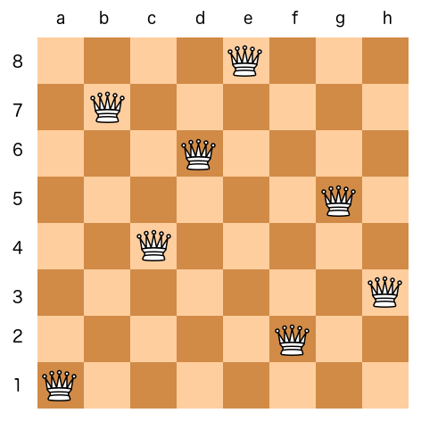

# N Queens
The N Queens puzzle is a classic problem of placing N chess queens on an N×N chessboard so that no two queens threaten each other.

## Contact
 * [Twitter](https://www.twitter.com/sakhilelindah) / [Github](https://github.com/sakhi-4096) / [Mail](mailto:sakhilelindah@protonmail.com)
